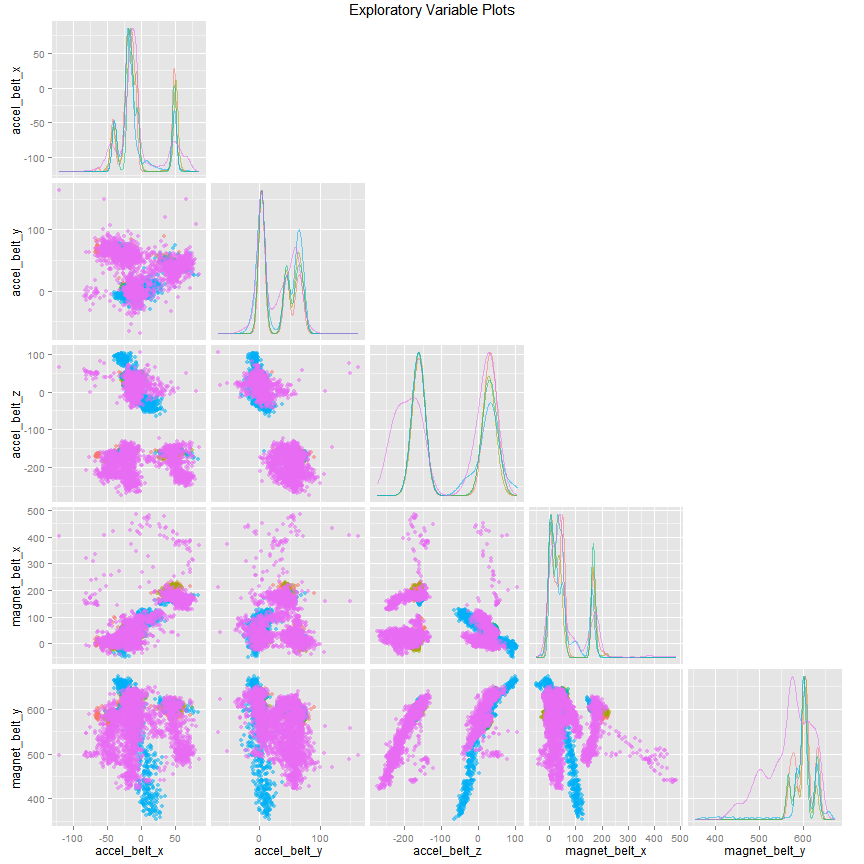

Quantified Self: Predicting Exercise Execution Class with Machine Learning Techniques
===================================================================================
## Summary
The quantified self movement is a rapidly growing field where individuals attempt to
measure activity levels of a variety of daily activities.  Fueled by the explosion 
of cheap sensors, these efforts to rigourously track activity have had great success in
quantifying how much or which activity you are performing.  The next frontier is objectively
addressing how well you are performing the activity. 

This report uses data from http://groupware.les.inf.puc-rio.br/har to attempt to classify
the manner in which an individual executed a Unilateral Dumbbell Biceps Curl. The exercise 
repetitions are classified into one of the following groups:

* A - exactly according to the specification
* B - throwing the elbows to the front
* C - lifting the dumbbell only halfway
* D - lowering the dumbbell only halfway
* E - throwing the hips to the front

After fitting several machine learning models, a 5-fold cross validated random forest 
model was identified as the top performing model.  Using the random forest model, the out of 
sample error rate was reduced to 0.17%.

## Loading Data and Necessary Packages


```r
suppressMessages(library(caret))
suppressMessages(library(ggplot2))
suppressMessages(library(GGally))
```
Data is loaded in and dimensions are checked. 

```r
train_url <- "https://d396qusza40orc.cloudfront.net/predmachlearn/pml-training.csv"
if(!file.exists('pml-training.csv')){
  download.file(train_url, destfile = 'pml-training.csv')
}
test_url <- "https://d396qusza40orc.cloudfront.net/predmachlearn/pml-testing.csv"
if(!file.exists('pml-testing.csv')){
  download.file(test_url, destfile = 'pml-testing.csv')
}
training <- read.csv('pml-training.csv', na.strings = c("NA", "", "#DIV/0!"))
testing <- read.csv('pml-testing.csv', na.strings = c("NA", "", "#DIV/0!"))
dim(training)
```

```
## [1] 19622   160
```

## Data Exploration and Cleaning

```r
str(training, list.len = 20)
```

```
## 'data.frame':	19622 obs. of  160 variables:
##  $ X                       : int  1 2 3 4 5 6 7 8 9 10 ...
##  $ user_name               : Factor w/ 6 levels "adelmo","carlitos",..: 2 2 2 2 2 2 2 2 2 2 ...
##  $ raw_timestamp_part_1    : int  1323084231 1323084231 1323084231 1323084232 1323084232 1323084232 1323084232 1323084232 1323084232 1323084232 ...
##  $ raw_timestamp_part_2    : int  788290 808298 820366 120339 196328 304277 368296 440390 484323 484434 ...
##  $ cvtd_timestamp          : Factor w/ 20 levels "02/12/2011 13:32",..: 9 9 9 9 9 9 9 9 9 9 ...
##  $ new_window              : Factor w/ 2 levels "no","yes": 1 1 1 1 1 1 1 1 1 1 ...
##  $ num_window              : int  11 11 11 12 12 12 12 12 12 12 ...
##  $ roll_belt               : num  1.41 1.41 1.42 1.48 1.48 1.45 1.42 1.42 1.43 1.45 ...
##  $ pitch_belt              : num  8.07 8.07 8.07 8.05 8.07 8.06 8.09 8.13 8.16 8.17 ...
##  $ yaw_belt                : num  -94.4 -94.4 -94.4 -94.4 -94.4 -94.4 -94.4 -94.4 -94.4 -94.4 ...
##  $ total_accel_belt        : int  3 3 3 3 3 3 3 3 3 3 ...
##  $ kurtosis_roll_belt      : num  NA NA NA NA NA NA NA NA NA NA ...
##  $ kurtosis_picth_belt     : num  NA NA NA NA NA NA NA NA NA NA ...
##  $ kurtosis_yaw_belt       : logi  NA NA NA NA NA NA ...
##  $ skewness_roll_belt      : num  NA NA NA NA NA NA NA NA NA NA ...
##  $ skewness_roll_belt.1    : num  NA NA NA NA NA NA NA NA NA NA ...
##  $ skewness_yaw_belt       : logi  NA NA NA NA NA NA ...
##  $ max_roll_belt           : num  NA NA NA NA NA NA NA NA NA NA ...
##  $ max_picth_belt          : int  NA NA NA NA NA NA NA NA NA NA ...
##  $ max_yaw_belt            : num  NA NA NA NA NA NA NA NA NA NA ...
##   [list output truncated]
```

```r
table(training$classe)
```

```
## 
##    A    B    C    D    E 
## 5580 3797 3422 3216 3607
```
For this analysis we are predicting the class of activity the user is performing--
A, B, C, D, or E.  The class split is even enough that I don't think we need to address 
class imbalance before we start modeling.

Looking at the data set, it appears the first several variables aren't needed.  'X'
is just an index of the observations and the timestamp variables are different representations
of the time the activity was performed.  While in a production setting these could be of
predicitive value, here, we want to identify activity type from sensor data. 
I remove all these variables for my analysis.

```r
training <- training[, -c(1, 3:6)]
```


```r
prop.table(table(training$user_name, training$classe), 1)
```

```
##           
##                    A         B         C         D         E
##   adelmo   0.2993320 0.1993834 0.1927030 0.1323227 0.1762590
##   carlitos 0.2679949 0.2217224 0.1584190 0.1561697 0.1956941
##   charles  0.2542421 0.2106900 0.1524321 0.1815611 0.2010747
##   eurico   0.2817590 0.1928339 0.1592834 0.1895765 0.1765472
##   jeremy   0.3459730 0.1437390 0.1916520 0.1534392 0.1651969
##   pedro    0.2452107 0.1934866 0.1911877 0.1796935 0.1904215
```

'User_name' may or may not be predictive. If we look at the proportion of a users 
activity by class, the proportions stay relatively constant between individual users.
Since all of our data is about these six individuals this variable appears useful.  
If we were trying to generalize a model to predict the class of activity by a new set
of users I would remove this variable.  For now, I will keep it.

#### Removing Variables with Excesssive NA Values
There are numerous NA values within the data.  For this relatively simple analysis, I 
am not going to dive too deeply into whether the presence of NA values is informative.
If a variable is greater than 90% NA values, I remove the variable.


```r
perc_na_greater_90 <- apply(!is.na(training), 2, sum) > nrow(training)* .9
training <- training[, perc_na_greater_90]
dim(training)
```

```
## [1] 19622    55
```

#### Removing Highly Correlated Variables
We are now down to a more managable number of variables for this analysis.
Let's remove highly correlated variables so we can test out how they affect linear 
models.


```r
correlated <- cor(training[, -c(1, 55)])
high_cor <- sort(findCorrelation(correlated, cutoff = .9))
low_cor_var <- training[, -c(1, high_cor)]
```
#### Exploratory Plot
To get a sense for the data, I plot a few of our features and examine the clustering.


```r
ggpairs(training, columns = 10:14, color = 'classe', upper = 'blank', alpha = .1,
        title = "Exploratory Variable Plots")
```

 

As you can see, there is significant overlapping, but clusters are evident within this
subset of variables.

## Creating training and validation set
For this report, I split my training data into a training set and a cross-validation set.
I do this for my data set with high correlations removed and for the full data set. After
training all my models with k-fold cross validation on this training set, I will perform
my out of sample error estimate using the cv data set.  This will give me a more accurate 
estimation of the performance of my models.

```r
set.seed(123)
index <- createDataPartition(training$classe, p = .7, list = FALSE)
train_full <- training[index,]
cv_full <- training[-index,]
train_uncor <- low_cor_var[index,]
cv_uncor <- low_cor_var[-index,]
```

By default, trainControl in the caret package uses 25-fold cross validation.  For our 
simple models here that seems unnecessary. I went with 5-fold cross validation to 
reduce computation time.


```r
set.seed(123)
ctrl <- trainControl(method = 'cv', number = 5)
```

## Model Fitting
I decided to test out three models on the data: linear discriminant analysis, stochastic
gradient boosting (gbm) and random forests. All models were fit with the base parameters
and no tuning was done to improve performance.  Models were fit using the training split
created above with 5-fold cross validation.  Out of sample error estimates were generated
using the cv split created above.

#### Linear Discriminant Analysis Model

```r
lda_fit <- train(classe ~ ., method = 'lda', trControl = ctrl,
                 data = train_uncor)
lda_fit_full <- train(classe~ ., method = 'lda', trControl = ctrl,
                      data = train_full)
```

After fitting both LDA models, I use the cross-validation set to estimate the out of 
sample error rate.

```r
lda_pred <- predict(lda_fit, newdata = cv_uncor)
lda_conf_mat <- confusionMatrix(lda_pred, cv_uncor$classe)

lda_pred_full <- predict(lda_fit_full, newdata = cv_full)
lda_conf_mat_full <- confusionMatrix(lda_pred_full, cv_full$classe)
```

The out of sample accuracy for these models is 67.63%
for the LDA model with correlated variables removed and 73.97%
for the LDA model with all variables included.  74% accuracy for this relatively simple
model is impressive, but we can definitely do better.

#### Gradient Boosting Machines

```r
gbm_fit_full <- train(classe ~ ., method = 'gbm', trControl = ctrl, data = train_full,
                      verbose = TRUE)
```


```r
gbm_pred_full <- predict(gbm_fit_full, newdata = cv_full)
gbm_conf_mat <- confusionMatrix(gbm_pred_full, cv_full$classe)
```

Using the same cross-validation setup used in the LDA models, the out of sample accuracy
is 98.61%. This is more than sufficient for this 
analysis, but let's see what random forests can do.

#### Random Forests

```r
set.seed(123)
rf_fit_full <- train(classe ~., method = 'rf', trControl = ctrl, data = train_full, 
                     do.trace = TRUE)
```


```r
rf_pred_full <- predict(rf_fit_full, newdata = cv_full)
rf_conf_mat <- confusionMatrix(rf_pred_full, cv_full$classe)
```

Our random forest model is the winner by a slight margin with an out of sample accuracy of
99.83%.  Since this is our best performer, let's have a 
look at the full confusion matrix.

```
## Confusion Matrix and Statistics
## 
##           Reference
## Prediction    A    B    C    D    E
##          A 1674    3    0    0    0
##          B    0 1136    4    0    0
##          C    0    0 1022    2    0
##          D    0    0    0  961    0
##          E    0    0    0    1 1082
## 
## Overall Statistics
##                                           
##                Accuracy : 0.9983          
##                  95% CI : (0.9969, 0.9992)
##     No Information Rate : 0.2845          
##     P-Value [Acc > NIR] : < 2.2e-16       
##                                           
##                   Kappa : 0.9979          
##  Mcnemar's Test P-Value : NA              
## 
## Statistics by Class:
## 
##                      Class: A Class: B Class: C Class: D Class: E
## Sensitivity            1.0000   0.9974   0.9961   0.9969   1.0000
## Specificity            0.9993   0.9992   0.9996   1.0000   0.9998
## Pos Pred Value         0.9982   0.9965   0.9980   1.0000   0.9991
## Neg Pred Value         1.0000   0.9994   0.9992   0.9994   1.0000
## Prevalence             0.2845   0.1935   0.1743   0.1638   0.1839
## Detection Rate         0.2845   0.1930   0.1737   0.1633   0.1839
## Detection Prevalence   0.2850   0.1937   0.1740   0.1633   0.1840
## Balanced Accuracy      0.9996   0.9983   0.9978   0.9984   0.9999
```

We have good performance across all classes with high levels of specificity and sensitivity.
Overall it looks like a very good model fit and we would expect to have about 0.17%
out of sample error.

## Conclusions
Using a random forest model, I was able to predict user activity class with 99.83%
accuracy.  While this is great, I am skeptical of the results.  It is highly unusual 
to have a model with such high performance.  Perhaps there is some underlying structure
to the dataset that the model is identifying to base its predictions on.  Regardless,
for the purposes of this analysis, the model was a success.  A next step would be applying
the model to data from a new group of users and seeing how the model performs.
